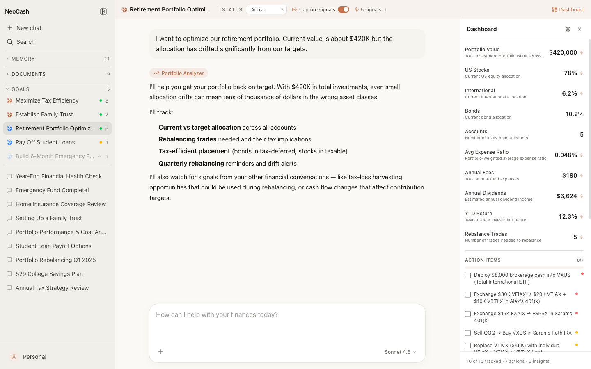
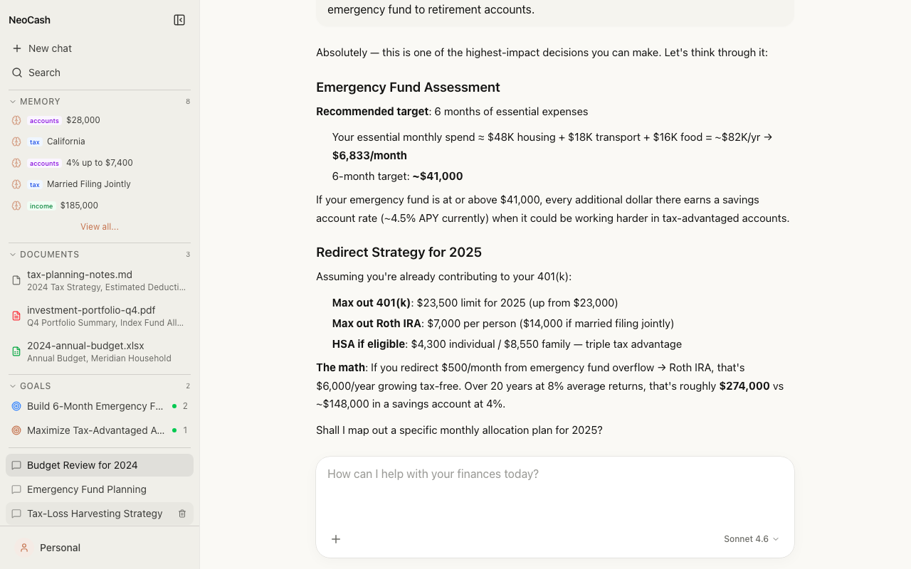
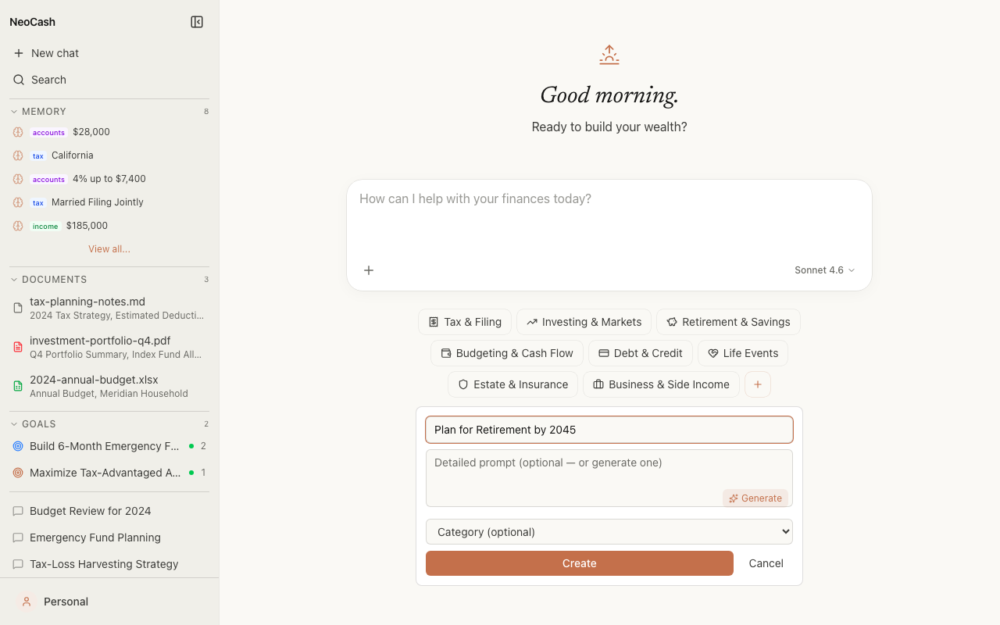
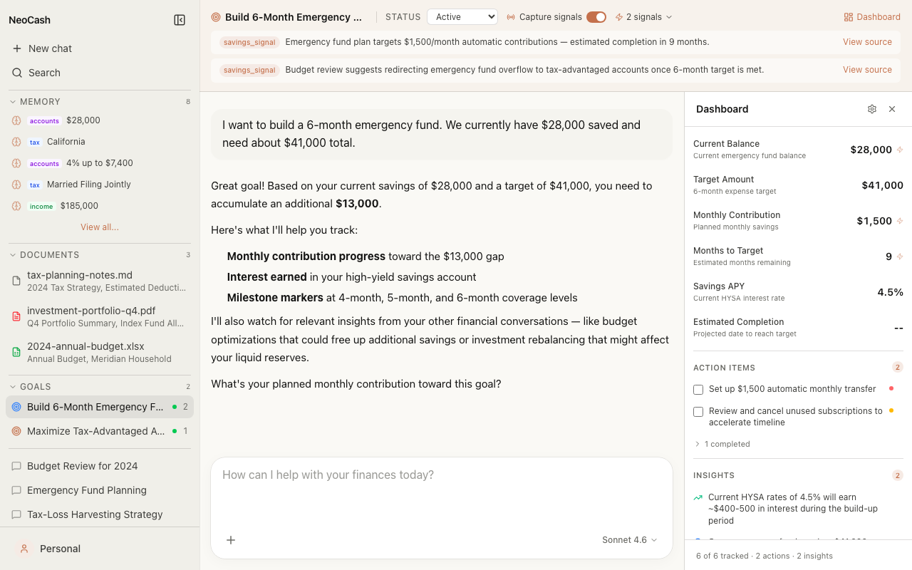
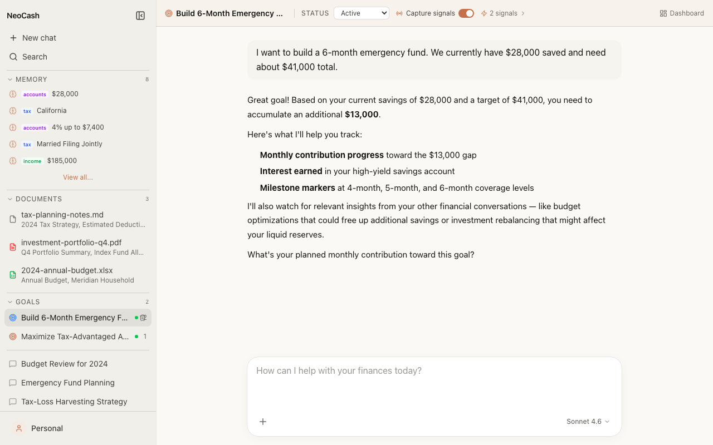
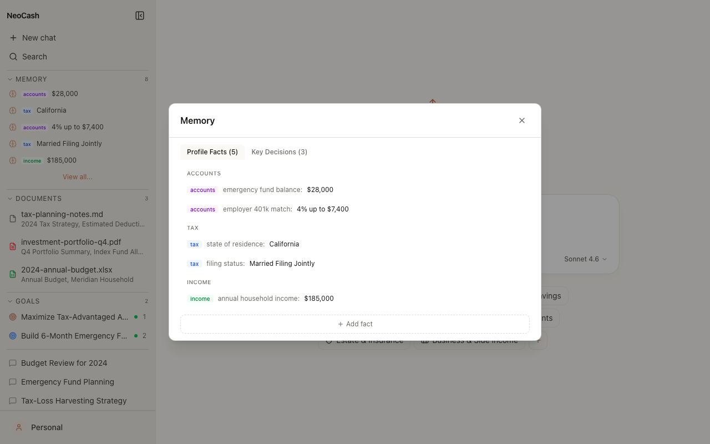
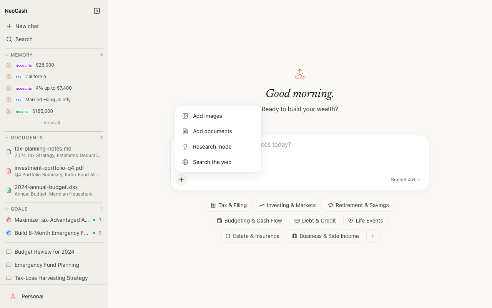
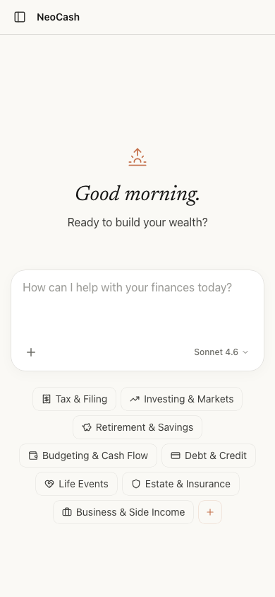

<p align="center">
  
</p>

<h1 align="center">NeoCash</h1>

<p align="center">
  <a href="LICENSE"></a>
  
  
  
  
</p>

<p align="center"><strong>Personal wealth management, without the institution.</strong></p>

---

## Your money. Your data. Your device.

NeoCash is an AI wealth advisor that runs entirely on your machine. No accounts to create. No cloud sync. No one watching. Your financial conversations, documents, and decisions stay in your browser's local storage — always.

Powered by Claude, it understands tax strategy, retirement planning, budgeting, and investment allocation. It remembers your financial profile across conversations, detects connections between topics, and tracks your goals automatically.

---

## Start a conversation about what matters

<p align="center">
  
</p>

Choose from eight wealth categories — tax, investing, retirement, budgeting, debt, insurance, estate planning, and business income. Each conversation gets Claude's full reasoning with markdown tables, calculations, and specific dollar amounts. Upload documents, search the web, or switch between Claude models mid-conversation.

---

## Set goals. Let the AI connect the dots.

### Create goals from any starting point

<p align="center">
  
</p>

Pick from eight wealth categories or create a custom goal. Enter a title and let the AI generate a detailed prompt — or write your own. Each goal becomes a dedicated thread that monitors your other conversations for relevant signals.

### Signals flow between conversations

<p align="center">
  
</p>

Discussing tax-loss harvesting in one chat? The AI detects that the savings could fund your emergency fund goal in another. Signals are categorized, summarized, and linked back to their source conversation — cross-pollination happens automatically in the background.

### Metrics that populate as you talk

<p align="center">
  
</p>

Open the Dashboard panel on any goal to see current balance, target progress, action items with checkboxes, and color-coded insights. Everything populates from your conversations — no manual data entry required.

---

## It remembers so you don't have to

<p align="center">
  
</p>

NeoCash builds a persistent financial profile from your conversations — income, filing status, account balances, key decisions. Facts are injected into every conversation. Decisions are keyword-matched when relevant. You stay in control: edit, delete, or add memories manually through the Memory editor.

---

## Research when you need it

<p align="center">
  
</p>

Upload spreadsheets, PDFs, and documents for analysis. Switch to research mode for deeper exploration. Search the web for current rates, tax rules, or market data — all without leaving the conversation.

---

## Built for mobile too

<p align="center">
  
</p>

---

## Quick Start

```bash
git clone https://github.com/manavsehgal/neocash.git
cd neocash
cp .env.example .env.local  # add your Anthropic API key
npm install
npm run dev
```

Open [localhost:3000](http://localhost:3000). Click your profile at the bottom left → **Load Sample Data** to explore the full experience with pre-built conversations, goals, signals, and memories.

---

## Built With

| Technology | Purpose |
|-----------|---------|
| [Next.js 16](https://nextjs.org) | App Router, React Server Components |
| [Vercel AI SDK v4](https://sdk.vercel.ai) | Streaming chat, tool use, transport layer |
| [Claude](https://anthropic.com) | Sonnet 4.6 (default), Haiku for background tasks |
| [Tailwind CSS 4](https://tailwindcss.com) | Design tokens, responsive layout |
| [IndexedDB](https://developer.mozilla.org/en-US/docs/Web/API/IndexedDB_API) | Local-first persistence via idb-keyval |
| [TypeScript](https://typescriptlang.org) | End-to-end type safety |

---

## Architecture

```
src/
├── app/
│   ├── api/chat/          # streamText with goal-aware system prompts
│   ├── api/detect-signals/ # Haiku-powered cross-pollination
│   ├── api/extract-memories/ # Haiku-powered memory extraction
│   └── chat/[chatId]/     # Dynamic chat + goal thread pages
├── components/
│   ├── chat/              # ChatPanel, MessageList, GoalSignalPanel
│   ├── layout/            # Sidebar, MemoryList, DocumentList
│   └── ui/                # Shared primitives
├── context/               # AppContext (sidebar state, reactivity)
├── hooks/                 # IndexedDB stores (chat, goal, signal, memory, document)
├── lib/                   # Pure functions, system prompts, sample data
└── types/                 # Shared TypeScript interfaces
```

**Key patterns:**

- **Local-first**: All data lives in IndexedDB with `idb-keyval`. No server database, no user accounts.
- **Fire-and-forget Haiku**: Signal detection and memory extraction run as background Haiku calls on `onFinish` — never blocking the main conversation.
- **Message windowing**: Long conversations are windowed to stay within context limits while preserving recent history.
- **Reactive sidebar**: `goalListVersion`, `memoryListVersion`, and `documentListVersion` counters in AppContext trigger re-fetches across components.

---

## Contributing

```bash
# Run tests
npx vitest run

# Development
npm run dev

# Type check
npx tsc --noEmit
```

Fork → branch → PR. Keep it local-first. No cloud dependencies.

---

## License

[Apache 2.0](LICENSE)
